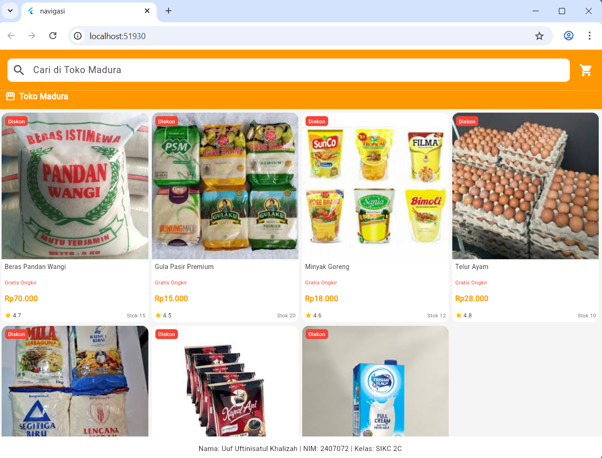
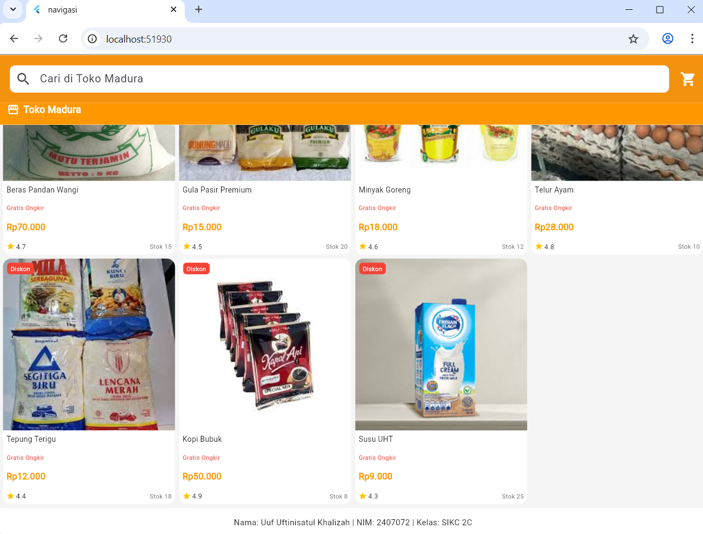

# Tugas praktikum 2 - Navigasi dan Rute Flutter

## Identitas

**Nama:** Uuf Uftinisatul Khalizah
**NIM:** 2407072

---

## Halaman Utama (HomePage)



**Penjelasan:**
Halaman utama menampilkan daftar barang menggunakan widget **ListView.builder**.
Data item berasal dari model `Item` yang berisi nama dan harga barang.

---

##  Halaman Detail (ItemPage)


**Penjelasan:**
Halaman ini menampilkan detail dari item yang dipilih, berupa nama dan harga barang.

---

##  Navigasi Antar Halaman



**Penjelasan:**
Navigasi dilakukan menggunakan:

```dart
Navigator.pushNamed(context, '/item', arguments: item);
```

Fungsi ini digunakan untuk berpindah halaman sekaligus mengirim data item.

---

##  Penerimaan Data (ModalRoute)


**Penjelasan:**
Data yang dikirim dari halaman sebelumnya diterima menggunakan:

```dart
final itemArgs = ModalRoute.of(context)!.settings.arguments as Item;
```

Data tersebut kemudian ditampilkan di halaman detail.

---

##  Kesimpulan

* Navigasi Flutter menggunakan **Navigator dan Route**
* Perpindahan halaman menggunakan **pushNamed**
* Data antar halaman dikirim menggunakan **arguments**
* Data diterima menggunakan **ModalRoute**

---
